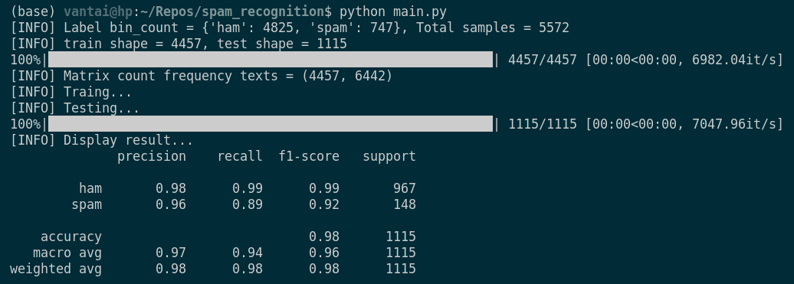

## Introduction
+ The SMS Spam Collection is a set of SMS tagged messages that have been collected for SMS Spam research. It contains one set of SMS messages 
in English of 5,574 messages, tagged acording being ham (legitimate) or spam.

+ We used Naive Bayes for solving this problem and the result is archived amazing about 98%.

    
